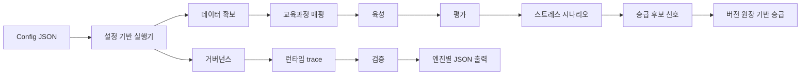

# 파이데이아 엔진

[English](README.md)

파이데이아 엔진은 AI 에이전트의 성장 시스템을 만들기 위한 로컬 우선 Python 엔진 모음입니다. 에이전트 자체도 중요한 결과물이지만, 그 안에 들어가는 데이터 확보, 교육과정 매핑, 육성, 평가, 스트레스 리허설, 승급, 거버넌스, 런타임, 오케스트레이션 엔진은 각각 독립적으로 재사용할 수 있는 핵심 자산입니다.

이 저장소는 각 엔진을 개별 제품처럼 개발하고, 필요할 때 설정 기반 실행기로 조합할 수 있도록 설계되었습니다.

## 왜 필요한가

AI 에이전트가 훈련, 평가, 기억, 실행, 통제를 하나의 불투명한 루프 안에서 처리하면 신뢰하기 어렵습니다. 파이데이아 엔진은 책임을 분리합니다.

- **데이터 확보 엔진**: 라이선스 gate를 기준으로 데이터 사용 계획을 만듭니다.
- **교육과정 매핑 엔진**: 성취기준을 학습 단위로 매핑합니다.
- **육성 엔진**: 훈련 청사진과 학습 로드맵을 만듭니다.
- **평가 엔진**: 결정적 rubric과 transcript로 결과물을 평가합니다.
- **스트레스 엔진**: 어려운 상황을 리허설하지만 기억을 직접 승급하지 않습니다.
- **승급 엔진**: 검증된 고품질 경험만 승급하고 약한 경험은 격리합니다.
- **거버넌스 엔진**: 로컬 우선 정책, 보스 검토 gate, 외부 업로드 제한을 적용합니다.
- **런타임 엔진**: trace와 artifact manifest가 있는 실행 기록을 만듭니다.
- **오케스트레이션 엔진**: 여러 엔진을 설정 기반 로컬 성장 실행으로 조합합니다.



## 로컬 개발 설치

```powershell
git clone https://github.com/sinmb79/22b-paideia-engines.git
cd 22b-paideia-engines
python -m pip install -e .[dev]
python -m pytest tests -q
```

## 빠른 시작

```python
from paideia_engines.orchestration import PaideiaEngineSuite

suite = PaideiaEngineSuite()
cycle = suite.run_growth_cycle(
    learner_id="agent:analyst",
    role="research analyst",
    objectives=["evidence-first answers"],
    task="prepare evidence summary",
)

print(cycle["promotion_decision"]["status"])
```

예제 실행:

```powershell
python examples/basic_growth_cycle.py
python examples/data_and_curriculum_pipeline.py
python examples/assessment_and_cultivation_pipeline.py
python examples/stress_and_promotion_pipeline.py
python examples/governance_and_runtime_pipeline.py
```

Phase 5 설정 기반 실행:

```powershell
python -m paideia_engines.cli run-config `
  --config examples/configured_suite.json `
  --output .paideia-runs/result.json `
  --output-dir .paideia-runs/engines

python -m paideia_engines.cli smoke --engine all --output .paideia-runs/smoke.json
```

## 엔진의 독립성

각 엔진은 class API와 결정적 dictionary 출력을 가집니다. 필요한 엔진만 골라 쓸 수 있습니다.

```python
from paideia_engines.contracts import ReviewLabel
from paideia_engines.promotion import PromotionEngine

engine = PromotionEngine(owner="agent:analyst")
decision = engine.record_experience(
    source="runtime",
    event={"summary": "Verified task result.", "skills": ["evidence_review"]},
    review=ReviewLabel(score=92, status="verified", reviewed_by="boss"),
)
```

## 현재 개발 상태

- Phase 1: 데이터 확보와 교육과정 매핑 core
- Phase 2: 평가와 육성 core
- Phase 3: 스트레스와 승급 core
- Phase 4: 거버넌스와 런타임 core
- Phase 5: 설정 기반 오케스트레이션과 CLI core
- Phase 6: 릴리스 하드닝, 엔진별 문서, 공개 자산 감사
- Phase 7: 확보 자료 검증, 공개 교육과정 어댑터, 공개 문항 bank 어댑터
- Phase 8: NCIC/data.go.kr, AI-Hub, 공개 시험 metadata 출처별 parser

## 문서

- [아키텍처](docs/architecture.ko.md)
- [Architecture in English](docs/architecture.md)
- [엔진 문서](docs/engines/README.ko.md)
- [Engine documentation in English](docs/engines/README.md)
- [데이터 확보 계획](docs/data_acquisition.ko.md)
- [Data acquisition plan in English](docs/data_acquisition.md)
- [진짜 엔진 개발 로드맵](docs/real_engine_development.ko.md)
- [Real engine development roadmap in English](docs/real_engine_development.md)
- [총괄 개발 마스터플랜](docs/master_development_plan.ko.md)
- [Master development plan in English](docs/master_development_plan.md)
- [릴리스 가이드](docs/release_guide.ko.md)
- [Release guide in English](docs/release_guide.md)
- [릴리스 체크리스트](docs/release_checklist.ko.md)
- [Release checklist in English](docs/release_checklist.md)
- [공개 자산 감사](docs/public_asset_audit.ko.md)
- [Public asset audit in English](docs/public_asset_audit.md)
- [데이터셋 어댑터 백로그](docs/dataset_adapter_backlog.ko.md)
- [Dataset adapter backlog in English](docs/dataset_adapter_backlog.md)
- [출처별 파서](docs/source_parsers.ko.md)
- [Source-specific parsers in English](docs/source_parsers.md)
- [예제 데이터 인덱스](docs/example_data_index.ko.md)
- [Example data index in English](docs/example_data_index.md)

## 안전 기본값

- 로컬 우선 데이터 경계
- 외부 업로드 기본 차단
- 비공개 자산 접근 시 보스 검토 필요
- 런타임 결과의 기억 승급 전 검토 필요
- 스트레스 시나리오는 promoted memory를 직접 쓰지 않음
- 격리된 경험은 활성 기억 라우팅에서 제외
- 대체된 promoted 경험은 원장에 남기되 활성 기억에서는 제외
- 런타임 trace와 artifact manifest는 검토 증거로 보존
- CLI 출력은 JSON이므로 실행을 감사하고 재검토할 수 있음
- 설정 기반 실행은 `acquisition_validation`과 `verification` JSON 출력을 남김

## 라이선스

MIT
