# Paideia Engines

[한국어](README.ko.md)

Paideia Engines is a local-first Python engine suite for building AI agent growth systems. The agent itself is only one product. The engines inside it are reusable assets: data acquisition, curriculum mapping, cultivation, assessment, stress rehearsal, promotion, governance, runtime tracing, and orchestration.

This repository is designed so each engine can be used independently or combined through a config-driven suite runner.

## Why This Exists

AI agents become hard to trust when training, evaluation, memory, runtime execution, and governance are mixed into one opaque loop. Paideia Engines separates those responsibilities:

- **Data Acquisition Engine**: plans data use with license gates.
- **Manifest Diagnostics**: validates acquired-source JSONL manifests before release or local corpus wiring.
- **Source Parser Diagnostics**: validates public-safe parser fixture packs before release.
- **Adapter Certification**: proves parser fixtures link to valid acquired-source manifest records.
- **Engine Contract Registry**: freezes public APIs, schemas, docs, examples, and safety boundaries.
- **Suite Output Validator**: cross-checks configured-suite result JSON and per-engine outputs before release.
- **Evaluation Engine**: validates benchmark packs against release evidence and regression thresholds.
- **Kibo Engine**: governs reviewed Kibo reuse and Pattern Candidate reinforcement with fail-closed direct reuse gates.
- **Curriculum Mapping Engine**: maps standards into learning units.
- **Cultivation Engine**: builds training blueprints and roadmaps.
- **Assessment Engine**: scores outputs with deterministic rubrics and transcripts.
- **Stress Engine**: runs resilience scenarios without directly promoting memory.
- **Stress Pack Diagnostics**: validates subject stress packs before reuse.
- **Promotion Engine**: promotes only verified high-quality experiences and quarantines weak ones.
- **Governance Engine**: enforces local-first safety, boss review gates, and upload restrictions.
- **Runtime Engine**: produces trace-first execution records and artifact manifests.
- **Orchestration Engine**: composes the engines into configured local growth runs.

```mermaid
flowchart LR
    Config["Config JSON"] --> Runner["Config Runner"]
    Runner --> Data["Data acquisition"]
    Data --> Parser["Source parser diagnostics"]
    Parser --> Curriculum["Curriculum mapping"]
    Curriculum --> Cultivation["Cultivation"]
    Cultivation --> Assessment["Assessment"]
    Assessment --> Stress["Stress scenarios"]
    Stress --> Signal["Candidate-only signal"]
    Signal --> Promotion["Versioned promotion ledger"]
    Runner --> Governance["Governance"]
    Governance --> Runtime["Runtime trace"]
    Runtime --> Verification["Verification"]
    Verification --> Outputs["Per-engine JSON outputs"]
    Outputs --> Validator["Suite output validator"]
    Validator --> Benchmark["Benchmark validation"]
```



## Install For Local Development

```powershell
git clone https://github.com/sinmb79/22b-paideia-engines.git
cd 22b-paideia-engines
python -m pip install -e .[dev]
python -m pytest tests -q
```

## Quick Start

```python
from paideia_engines.orchestration import PaideiaEngineSuite

suite = PaideiaEngineSuite()
cycle = suite.run_growth_cycle(
    learner_id="agent:analyst",
    role="research analyst",
    objectives=["evidence-first answers"],
    task="prepare evidence summary",
)

print(cycle["promotion_decision"]["status"])
```

Run the examples:

```powershell
python examples/basic_growth_cycle.py
python examples/data_and_curriculum_pipeline.py
python examples/assessment_and_cultivation_pipeline.py
python examples/stress_and_promotion_pipeline.py
python examples/governance_and_runtime_pipeline.py
```

Run the Phase 5 config-driven suite:

```powershell
python -m paideia_engines.cli run-config `
  --config examples/configured_suite.json `
  --output .paideia-runs/result.json `
  --output-dir .paideia-runs/engines

python -m paideia_engines.cli validate-suite-output `
  --output-dir .paideia-runs/engines `
  --result .paideia-runs/result.json `
  --output .paideia-runs/suite-output-validation.json

python -m paideia_engines.cli smoke --engine all --output .paideia-runs/smoke.json

python -m paideia_engines.cli validate-benchmarks `
  --pack examples/benchmark_packs/core_engine_benchmark_pack.json `
  --result .paideia-runs/result.json `
  --output-dir .paideia-runs/engines `
  --reports-dir .paideia-runs `
  --output .paideia-runs/benchmark-validation.json
```

## Engine Independence

Each engine has a class API and deterministic dictionary output. You can import only what you need:

```python
from paideia_engines.contracts import ReviewLabel
from paideia_engines.promotion import PromotionEngine

engine = PromotionEngine(owner="agent:analyst")
decision = engine.record_experience(
    source="runtime",
    event={"summary": "Verified task result.", "skills": ["evidence_review"]},
    review=ReviewLabel(score=92, status="verified", reviewed_by="boss"),
)
```

## Current Development Status

- Phase 1: data acquisition and curriculum mapping core
- Phase 2: assessment and cultivation core
- Phase 3: stress and promotion core
- Phase 4: governance and runtime core
- Phase 5: config-driven orchestration and CLI core
- Phase 6: release hardening, per-engine docs, and public asset audit
- Phase 7: acquired-source validation, public curriculum adapters, and public item-bank adapters
- Phase 8: NCIC/data.go.kr, AI-Hub, and public exam metadata source parsers
- Phase 9: parser diagnostics and public-safe source fixture packs
- Phase 10: configured-suite output validator
- Phase 11: acquired-source manifest diagnostics
- Phase 12: subject-specific stress scenario packs
- Phase 13: engine contract registry and validation
- Phase 14: official adapter certification matrix
- Phase 15: evaluation and benchmark pack
- Phase 16: persistent runtime evidence store
- Phase 17: release candidate pipeline
- Phase 18: downstream reuse recipes
- Phase 19: Kibo pattern reinforcement governance

## Documentation

- [Architecture](docs/architecture.md)
- [Architecture in Korean](docs/architecture.ko.md)
- [Engine contract registry](docs/engine_contracts.md)
- [Engine contract registry in Korean](docs/engine_contracts.ko.md)
- [Engine documentation](docs/engines/README.md)
- [Engine documentation in Korean](docs/engines/README.ko.md)
- [Data acquisition plan](docs/data_acquisition.md)
- [Data acquisition plan in Korean](docs/data_acquisition.ko.md)
- [Real engine development roadmap](docs/real_engine_development.md)
- [Real engine development roadmap in Korean](docs/real_engine_development.ko.md)
- [Master development plan](docs/master_development_plan.md)
- [Master development plan in Korean](docs/master_development_plan.ko.md)
- [Release guide](docs/release_guide.md)
- [Release guide in Korean](docs/release_guide.ko.md)
- [Release checklist](docs/release_checklist.md)
- [Release checklist in Korean](docs/release_checklist.ko.md)
- [Public asset audit](docs/public_asset_audit.md)
- [Public asset audit in Korean](docs/public_asset_audit.ko.md)
- [Dataset adapter backlog](docs/dataset_adapter_backlog.md)
- [Dataset adapter backlog in Korean](docs/dataset_adapter_backlog.ko.md)
- [Source-specific parsers](docs/source_parsers.md)
- [Source-specific parsers in Korean](docs/source_parsers.ko.md)
- [Example data index](docs/example_data_index.md)
- [Example data index in Korean](docs/example_data_index.ko.md)
- [Downstream reuse recipes](docs/downstream_reuse_recipes.md)
- [Downstream reuse recipes in Korean](docs/downstream_reuse_recipes.ko.md)

## Safety Defaults

- Local-first data boundary.
- External uploads blocked by default.
- Private assets require boss review.
- Runtime outputs require review before memory promotion.
- Stress scenarios never write promoted memory directly.
- Quarantined experiences are excluded from active memory routing.
- Superseded promoted experiences remain in the ledger but are not active memory.
- Runtime traces and artifact manifests are retained as review evidence.
- CLI output is JSON so runs can be audited and replayed.
- Configured runs write `acquisition_validation` and `verification` JSON outputs.
- Suite output validation checks per-engine files, schemas, and stress-to-promotion boundaries before release.
- Manifest diagnostics block malformed, duplicate, unsafe, or non-public full-content source records before release.
- Stress pack diagnostics keep subject scenarios curriculum-linked and promotion-boundary clean.
- Benchmark validation checks golden schemas, mutation expectations, and release evidence thresholds.
- Runtime evidence validation checks copied artifact existence, size, hash, and disk-based replay.
- Release candidate validation checks packaging metadata, links, UTF-8 readability, replacement characters, sensitive patterns, personal paths, acquired-source manifest boundaries, and public asset boundaries.

## License

MIT
