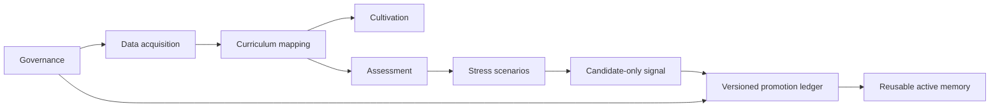

# Paideia Engines

[한국어](README.ko.md)

Paideia Engines is a local-first Python engine suite for building AI agent growth systems. The agent itself is only one product. The engines inside it are reusable assets: cultivation, assessment, stress rehearsal, promotion, governance, runtime tracing, and orchestration.

This repository is designed so each engine can be used independently or combined through `PaideiaEngineSuite`.

## Why This Exists

AI agents become hard to trust when training, evaluation, memory, runtime execution, and governance are mixed into one opaque loop. Paideia Engines separates those responsibilities:

- **Cultivation Engine**: builds training blueprints and curriculum handoffs.
- **Assessment Engine**: scores outputs with deterministic rubrics and transcripts.
- **Stress Engine**: runs resilience scenarios without directly promoting memory.
- **Promotion Engine**: promotes only verified high-quality experiences and quarantines weak ones.
- **Governance Engine**: enforces local-first safety, boss review gates, and upload restrictions.
- **Runtime Engine**: produces trace-first execution records and acceptance checklists.
- **Orchestration Engine**: composes the engines into an end-to-end growth cycle.



## Install For Local Development

```powershell
git clone https://github.com/sinmb79/22b-paideia-engines.git
cd 22b-paideia-engines
python -m pip install -e .[dev]
python -m pytest tests -q
```

## Quick Start

```python
from paideia_engines.orchestration import PaideiaEngineSuite

suite = PaideiaEngineSuite()
cycle = suite.run_growth_cycle(
    learner_id="agent:analyst",
    role="research analyst",
    objectives=["evidence-first answers"],
    task="prepare evidence summary",
)

print(cycle["promotion_decision"]["status"])
```

Run the examples:

```powershell
python examples/basic_growth_cycle.py
python examples/data_and_curriculum_pipeline.py
python examples/assessment_and_cultivation_pipeline.py
python examples/stress_and_promotion_pipeline.py
```

## Engine Independence

Each engine has a class API and deterministic dictionary output. You can import only what you need:

```python
from paideia_engines.contracts import ReviewLabel
from paideia_engines.promotion import PromotionEngine

engine = PromotionEngine(owner="agent:analyst")
decision = engine.record_experience(
    source="runtime",
    event={"summary": "Verified task result.", "skills": ["evidence_review"]},
    review=ReviewLabel(score=92, status="verified", reviewed_by="boss"),
)
```

Phase 3 adds a stress scenario bank and a versioned promotion ledger. Stress can emit a candidate-only signal, but it never creates a promotion decision. Promotion owns the auditable ledger, quarantine reconsideration, and supersession history.

## Documentation

- [Architecture](docs/architecture.md)
- [Architecture in Korean](docs/architecture.ko.md)
- [Data acquisition plan](docs/data_acquisition.md)
- [Data acquisition plan in Korean](docs/data_acquisition.ko.md)
- [Real engine development roadmap](docs/real_engine_development.md)
- [Real engine development roadmap in Korean](docs/real_engine_development.ko.md)
- [Master development plan](docs/master_development_plan.md)
- [Master development plan in Korean](docs/master_development_plan.ko.md)

## Safety Defaults

- Local-first data boundary.
- External uploads blocked by default.
- Private assets require boss review.
- Runtime outputs require review before memory promotion.
- Stress scenarios never write promoted memory directly.
- Quarantined experiences are excluded from active memory routing.
- Superseded promoted experiences remain in the ledger but are not active memory.

## License

MIT
