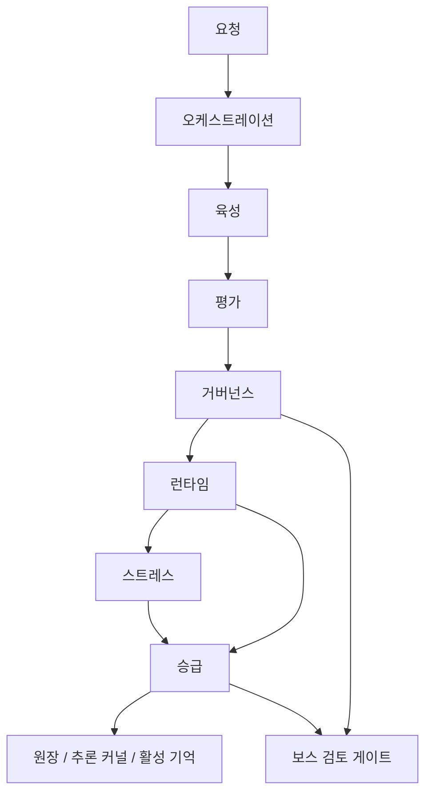

# 아키텍처

[English](architecture.md)

파이데이아 엔진은 하나의 에이전트 루프가 아니라 명확한 엔진 경계를 중심으로 구성됩니다.

## 공통 계약

`paideia_engines.contracts`는 엔진들이 공유하는 작은 계약을 정의합니다.

- `EngineEvent`
- `ReviewLabel`
- `PromotionDecision`
- `QuarantineDecision`
- `default_local_policy()`

계약은 작게 유지합니다. 그래야 각 엔진이 독립적으로 개발되고 재사용될 수 있습니다.

## 엔진 경계

| 엔진 | 책임 | 책임이 아닌 것 |
| --- | --- | --- |
| 육성 | 청사진, 커리큘럼, handoff | 채점, 승급 |
| 평가 | rubric 결과, transcript | 기억 승급 |
| 스트레스 | 시나리오 rollout, 복원력 신호 | 승급 결정 |
| 승급 | 원장, 격리, 활성 기억 라우팅 | 작업 실행 |
| 거버넌스 | 검토 게이트, 로컬 정책 | 모델 출력 생성 |
| 런타임 | trace, checklist, 작업 실행 기록 | 학습 업데이트 |
| 오케스트레이션 | 엔진 조합 | 엔진 내부 정책 |

## 설계 규칙

어떤 엔진도 다른 엔진의 결정을 조용히 대신하면 안 됩니다. 예를 들어 스트레스 엔진은 승급 후보 신호를 만들 수 있지만, 실제 승급 결정은 승급 엔진만 만들어야 합니다.
