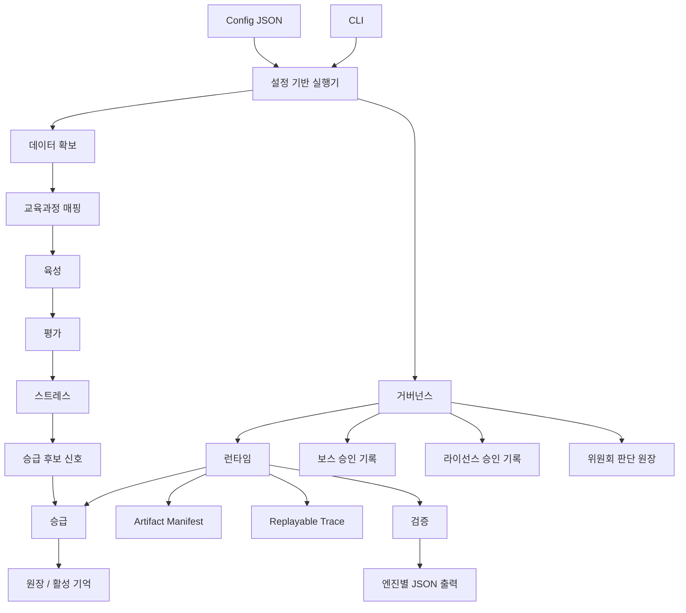

# 아키텍처

[English](architecture.md)

파이데이아 엔진은 하나의 에이전트 루프가 아니라, 명확한 엔진 경계를 중심으로 구성됩니다. 각 엔진은 한 종류의 판단을 책임지고, 다른 엔진이 소비할 수 있는 결정적 기록을 남깁니다.

## 공통 계약

`paideia_engines.contracts`는 엔진들이 공유하는 작은 계약을 정의합니다.

- `EngineEvent`
- `ReviewLabel`
- `PromotionDecision`
- `QuarantineDecision`
- `default_local_policy()`

계약은 의도적으로 작게 유지합니다. 그래야 각 엔진이 독립적으로 개발되고 재사용될 수 있습니다.

## 엔진 경계

| 엔진 | 책임 | 책임이 아닌 것 |
| --- | --- | --- |
| 데이터 확보 | 출처 판단, 라이선스 gate, 확보 manifest | 교육과정 설계 |
| 교육과정 매핑 | 학습 단위와 성취기준 coverage | 채점 또는 승급 |
| 육성 | 청사진, 로드맵, handoff | 채점, 승급 |
| 평가 | 문항 bank, rubric 결과, transcript | 기억 승급 |
| 스트레스 | 시나리오 bank, 회복력 신호 | 승급 결정 |
| 승급 | 버전 원장, 격리, 활성 기억 라우팅 | 작업 실행 |
| 거버넌스 | 정책 평가, 승인 기록, 위원회 판단 | 모델 출력 생성 |
| 런타임 | 실행 trace, artifact manifest, replay evidence, checklist | 학습 업데이트 |
| 오케스트레이션 | 설정 기반 실행기, CLI 조합, 출력 경로, 검증 요약 | 각 엔진 내부 정책 |

## 설계 규칙

어떤 엔진도 다른 엔진의 결정을 조용히 대신하면 안 됩니다. 스트레스 엔진은 승급 후보 신호를 만들 수 있지만, 실제 승급 결정은 승급 엔진만 만들 수 있습니다. 런타임은 증거를 기록할 수 있지만 기억을 활성화하지 않습니다. 거버넌스는 실행을 허용하거나 차단할 수 있지만 모델 출력을 생성하지 않습니다. 설정 기반 실행기는 엔진을 조합하고 산출물과 검증 요약을 저장하지만, 각 엔진 결과의 의미를 바꾸지 않습니다.
