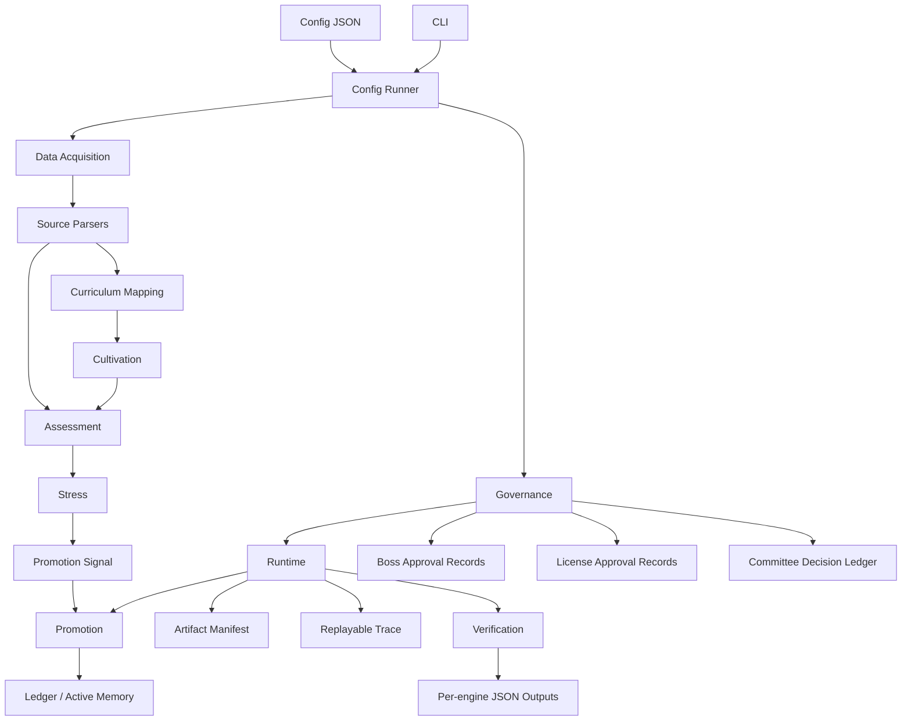

# Architecture

[한국어](architecture.ko.md)

Paideia Engines is organized around engine boundaries rather than a single agent loop. Each engine owns one kind of decision and emits deterministic records that other engines can consume.

## Contracts

`paideia_engines.contracts` defines shared objects:

- `EngineEvent`
- `ReviewLabel`
- `PromotionDecision`
- `QuarantineDecision`
- `default_local_policy()`

Contracts are intentionally small so every engine can stay independent.

## Engine Boundaries

| Engine | Owns | Does Not Own |
| --- | --- | --- |
| Data Acquisition | source decisions, license gates, acquisition manifests | curriculum design |
| Source Parsers | local CSV/JSON normalization after validation | downloading, scraping, license decisions |
| Curriculum Mapping | learning units and standard coverage | scoring or promotion |
| Cultivation | blueprint, roadmaps, handoffs | scoring, promotion |
| Assessment | item bank, rubric result, transcript | memory promotion |
| Stress | scenario bank, resilience signal | promotion decision |
| Promotion | versioned ledger, quarantine, active memory route | task execution |
| Governance | policy evaluation, approval records, committee decisions | model output generation |
| Runtime | run trace, artifact manifest, replay evidence, checklist | learning update |
| Orchestration | config runner, CLI composition, output paths, verification summary | internal engine policy |

## Design Rule

No engine should silently perform another engine's decision. Source parsers can normalize a verified local file, but they cannot decide whether the file is legally usable. Stress can produce a promotion candidate signal, but only Promotion can create a promotion decision. Runtime can record evidence, but it cannot make memory active. Governance can block or allow a run, but it does not generate model output. The Config Runner composes engines, writes outputs, and emits a verification summary; it does not rewrite the meaning of any engine result.

## Trust Boundary

Configured-suite outputs use trace schema v2 so review tools can rely on this order: assessment and stress first, then governance and runtime, then promotion, then verification. Promotion must enforce governance-blocked promotion quarantine: if Governance returns `blocked`, the Promotion record must be quarantined and require boss review even when Assessment produced a high score. Reconsidering that quarantine requires a fresh allowed `paideia-governance-review/v1` payload for `memory_promotion`, scoped to the quarantined `experience_id`, the promotion-issued `quarantine_ref`, and `active_memory` use, with an active `boss_approval` for that same `experience_id` and `quarantine_ref` present in the governance approval ledger; a bare decision string is not enough. A verified artifact is only a release-reviewable evidence claim until runtime evidence bundle validation proves the copied file, byte hash, manifest hash, and replay trace; deeper bundle-backed promotion is tracked for the v0.3 evidence pipeline.
