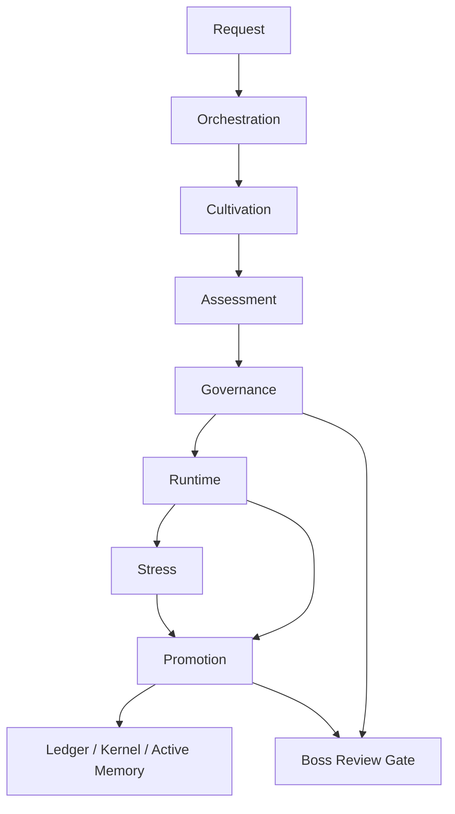

# Architecture

[한국어](architecture.ko.md)

Paideia Engines is organized around engine boundaries rather than a single agent loop.

## Contracts

`paideia_engines.contracts` defines shared objects:

- `EngineEvent`
- `ReviewLabel`
- `PromotionDecision`
- `QuarantineDecision`
- `default_local_policy()`

Contracts are intentionally small so every engine can stay independent.

## Engine Boundaries

| Engine | Owns | Does Not Own |
| --- | --- | --- |
| Cultivation | blueprint, curriculum, handoffs | scoring, promotion |
| Assessment | rubric result, transcript | memory promotion |
| Stress | scenario rollout, resilience signal | promotion decision |
| Promotion | ledger, quarantine, active memory route | task execution |
| Governance | review gates, local policy | model output generation |
| Runtime | trace, checklist, task run record | learning update |
| Orchestration | composition | internal engine policy |

## Design Rule

No engine should silently perform another engine's decision. For example, stress can produce a promotion candidate signal, but only promotion can create a promotion decision.
