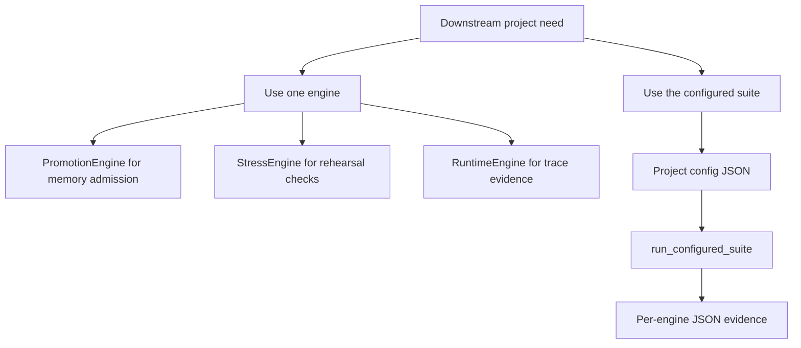

# Downstream 재사용 레시피

[English](downstream_reuse_recipes.md)

이 문서는 다른 22B 프로젝트가 에이전트 내부 코드를 복사하지 않고, Paideia Engines를 독립 자산으로 가져다 쓰는 방법을 보여줍니다.

## 통합 방식 선택



이미 자체 runner가 있는 프로젝트는 필요한 엔진 하나만 가져다 쓰는 편이 좋습니다. 예를 들어 memory promotion gate, stress rehearsal, runtime trace evidence만 독립적으로 붙일 수 있습니다.

반대로 데이터 검증, 교육과정 매핑, 육성, 평가, 스트레스, 승급, 거버넌스, 런타임, 검증까지 한 번에 필요하다면 configured suite를 쓰는 편이 좋습니다.

## 레시피 1: 단일 엔진

실행:

```powershell
python examples\downstream_single_engine_recipe.py
```

사용 import:

```python
from paideia_engines.promotion import PromotionEngine
```

이 레시피는 검증된 고품질 경험만 promoted memory로 올리고, 약한 경험은 quarantined 상태로 남깁니다. Downstream agent는 `route_active_memory(...)`를 호출해 active memory만 가져오고 quarantined record는 route에서 제외할 수 있습니다.

## 레시피 2: 전체 Suite

실행:

```powershell
python examples\downstream_suite_recipe.py
```

사용 import:

```python
from paideia_engines.orchestration import load_config, run_configured_suite
```

Downstream project는 자기 config file을 유지하고 `config_base_dir`를 넘겨 상대 경로를 자기 프로젝트 기준으로 해석하게 만들 수 있습니다.

## 데이터 경계

- Licensed textbook, AI-Hub corpus, private voice asset, personal image, raw exam archive는 public repository 밖에 둡니다.
- Public example에는 metadata, synthetic example, open-public sample만 둡니다.
- License review 이후 local evidence는 acquired-source manifest로 연결합니다.
- Downstream package나 fork를 공개하기 전 `validate-release-candidate`를 실행합니다.

## 마이그레이션 메모

- 이미 안정된 workflow가 있는 프로젝트는 engine 하나부터 붙입니다.
- 여러 엔진의 JSON evidence를 공유해야 할 때 `run_configured_suite(...)`로 확장합니다.
- Engine output은 contract로 취급합니다. 저장하고, 검증하고, review 후 promotion합니다.
- Runtime output은 직접 promoted memory로 올리지 말고 assessment, governance, promotion decision을 거치게 합니다.
