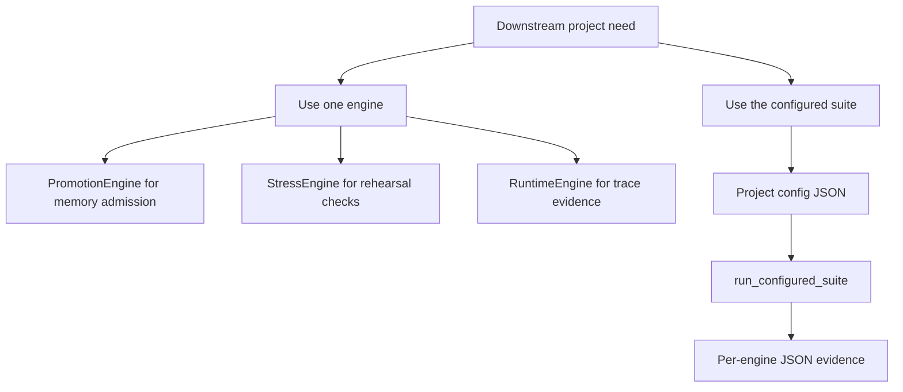

# Downstream Reuse Recipes

[한국어](downstream_reuse_recipes.ko.md)

These recipes show how another 22B project can use Paideia Engines without copying the internal agent code.

## Choose The Integration Shape



Use one engine when the downstream project already has its own runner and only needs a focused asset, such as promotion gating or stress rehearsal.

Use the configured suite when the downstream project needs a complete local growth loop with data validation, curriculum mapping, cultivation, assessment, stress, promotion, governance, runtime, and verification.

## Recipe 1: Single Engine

Run:

```powershell
python examples\downstream_single_engine_recipe.py
```

This imports:

```python
from paideia_engines.promotion import PromotionEngine
```

The recipe promotes only verified high-quality experiences and keeps weak experiences quarantined. A downstream agent can call `route_active_memory(...)` to retrieve active memory without mixing quarantined records into the route.

## Recipe 2: Full Suite

Run:

```powershell
python examples\downstream_suite_recipe.py
```

This imports:

```python
from paideia_engines.orchestration import load_config, run_configured_suite
```

The downstream project can keep its own config file and pass a `config_base_dir` so relative source paths resolve inside that project instead of inside this repository.

## Data Boundary

- Keep licensed textbooks, AI-Hub corpora, private voice assets, personal images, and raw exam archives outside the public repository.
- Put only metadata, synthetic examples, or open-public samples in public examples.
- Use acquired-source manifests to point to local evidence after license review.
- Run `validate-release-candidate` before publishing a downstream package or fork.

## Migration Notes

- Start with one engine if the project already has a stable workflow.
- Move to `run_configured_suite(...)` when you need shared JSON evidence across multiple engines.
- Treat engine outputs as contracts: persist them, validate them, and review them before promotion.
- Do not promote runtime outputs directly; route through assessment, governance, and promotion decisions.
