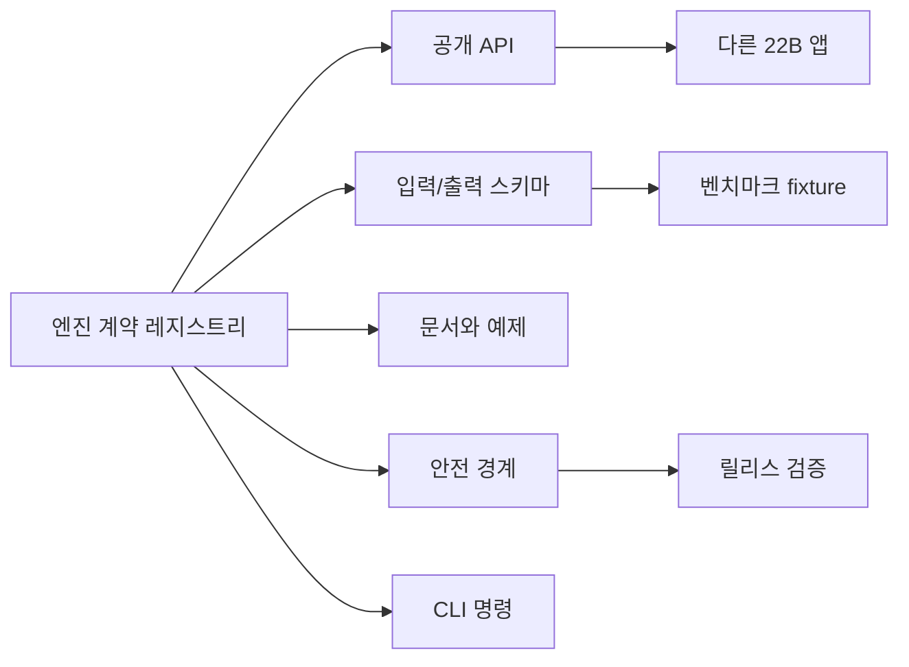

# 엔진 계약 레지스트리

[English](engine_contracts.md)

Phase 13은 현재 재사용 엔진 스위트의 공개 계약면을 고정합니다. 이것은 프로젝트가 끝났다는 뜻이 아니라, 이후 심화 개발이 흐릿한 경계 위에서 흔들리지 않도록 기준선을 세우는 단계입니다.

## 계약의 목적

각 엔진 계약은 다음을 선언합니다.

- 공개 API 이름
- 입력/출력 스키마 이름
- CLI 명령
- 예제 파일과 문서 파일
- 엔진을 단독 재사용할 때 반드시 지켜야 하는 안전 경계
- 1.0 이전 변경 호환성 정책



## 계약 검증

```powershell
python -m paideia_engines.cli validate-contracts `
  --repo-root . `
  --output .paideia-runs/contract-validation.json
```

필수 엔진이 레지스트리에 없거나, 계약 이름이 중복되거나, 문서화된 패키지/예제/README 경로가 없으면 이 명령은 실패합니다.

## 호환성 정책

- `1.0` 이전에는 공개 API와 스키마의 추가 변경을 허용합니다.
- 깨지는 변경은 새 `/vN` 스키마와 migration note가 필요합니다.
- 제거 예정 API는 제거 전에 문서화해야 합니다.
- 오케스트레이션은 개별 엔진 계약을 숨기면 안 됩니다.

## 현재 계약 고정 엔진

- 데이터 확보
- 교육과정 매핑
- 육성
- 평가
- 스트레스
- 승급
- 거버넌스
- 런타임
- 오케스트레이션
- 평가/벤치마크

레지스트리는 `src/paideia_engines/contracts/registry.py`에 있습니다.
