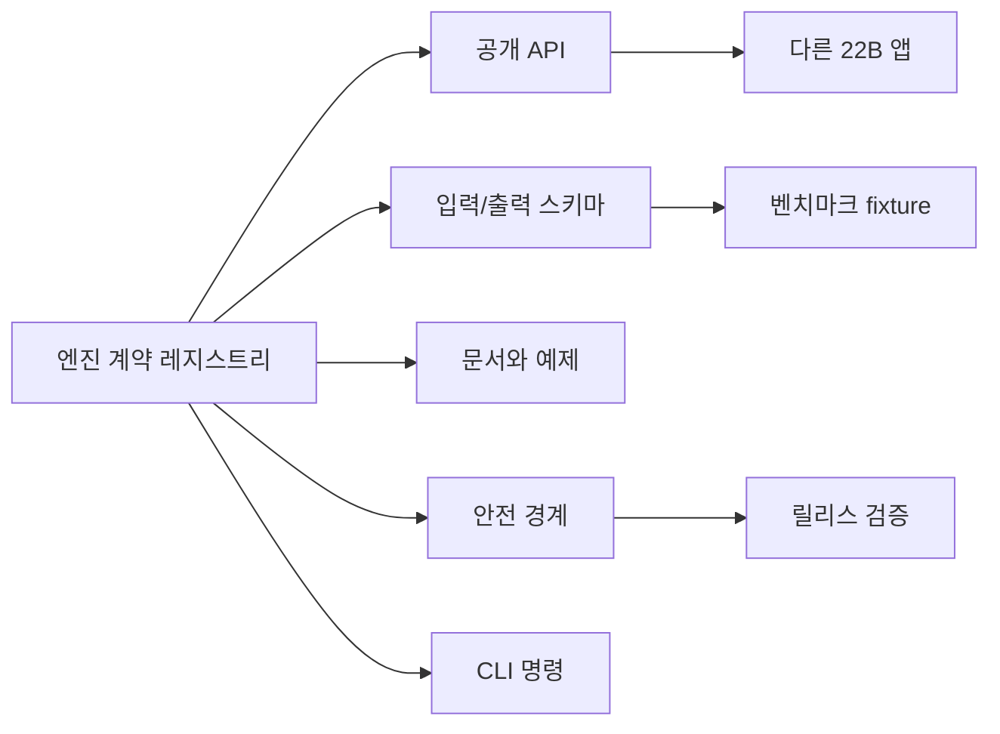

# 엔진 계약 레지스트리

[English](engine_contracts.md)

Phase 13은 현재 재사용 엔진 스위트의 공개 계약면을 고정합니다. 이것은 프로젝트가 끝났다는 뜻이 아니라, 이후 심화 개발이 흐릿한 경계 위에서 흔들리지 않도록 기준선을 세우는 단계입니다.

## 계약의 목적

각 엔진 계약은 다음을 선언합니다.

- 공개 API 이름
- 입력/출력 스키마 이름
- CLI 명령
- 예제 파일과 문서 파일
- 엔진을 단독 재사용할 때 반드시 지켜야 하는 안전 경계
- 1.0 이전 변경 호환성 정책



## 계약 검증

```powershell
python -m paideia_engines.cli validate-contracts `
  --repo-root . `
  --output .paideia-runs/contract-validation.json
```

필수 엔진이 레지스트리에 없거나, 계약 이름이 중복되거나, 문서화된 패키지/예제/README 경로가 없으면 이 명령은 실패합니다.

## 호환성 정책

- `1.0` 이전에는 공개 API와 스키마의 추가 변경을 허용합니다.
- 깨지는 변경은 새 `/vN` 스키마와 migration note가 필요합니다.
- 제거 예정 API는 제거 전에 문서화해야 합니다.
- 오케스트레이션은 개별 엔진 계약을 숨기면 안 됩니다.

## 현재 계약 고정 엔진

- 데이터 확보
- 교육과정 매핑
- 육성
- 평가
- 스트레스
- 승급
- 거버넌스
- 런타임
- 오케스트레이션
- 평가/벤치마크

## 신뢰 경계 노트

- 오케스트레이션 출력은 promotion이 governance와 runtime 뒤에 배치될 때 trace schema v2를 선언해야 합니다.
- 승급 엔진은 governance-blocked promotion quarantine 계약을 지켜야 합니다. blocked governance는 active memory를 만들 수 없고, 보스가 검토할 수 있는 quarantined record만 남길 수 있습니다.
- `quarantine_reason`은 force-quarantine 신호입니다. governance-blocked quarantine은 quarantined `experience_id`, promotion이 발급한 `quarantine_ref`, `active_memory` 사용 범위에 묶인 `memory_promotion`용 `paideia-governance-review/v1` governance review payload가 fresh allowed governance decision과 governance approval ledger 안의 같은 `experience_id` 및 `quarantine_ref` active `boss_approval` record를 증명하지 않으면 재심사 단계에서 promoted가 될 수 없습니다.
- `quarantine_ref`는 intentionally non-deterministic 값입니다. 이 값은 하나의 governance-blocked quarantine 재심사에만 쓰이는 local capability token 역할을 하므로, replay-stable ledger는 같은 입력에서 이 토큰이 반복되기를 기대하지 말고 주변 ledger field와 evidence bundle을 비교해야 합니다.
- Governance APIs return snapshots: 반환된 approval, review, committee decision payload는 내부 ledger/trail entry와 mutable object를 공유하면 안 됩니다.
- Governance ledgers and reviews use private stores with read-only snapshot accessors 규칙을 따릅니다. governance board/evaluation output도 mutable internal policy object를 노출하지 않고 policy snapshots를 사용해야 합니다.
- Promotion ledgers and events use private stores 규칙을 따릅니다. public accessor는 read-only이며 detached mutable snapshots를 반환하므로, 반환된 promotion decision, memory route, ledger snapshot, event snapshot을 수정해도 엔진 내부 상태가 바뀌면 안 됩니다.
- Promotion trust config is fixed at engine initialization: `owner and minimum_score`는 read-only accessor이며 downstream code가 ledger identity 또는 promotion quality gate를 조용히 바꿀 수 없어야 합니다.
- 평가 엔진은 결정적 rubric scoring을 위해 verified artifact를 셀 수 있지만, release-grade promotion은 runtime evidence validation이 파일 존재, byte hash, manifest hash, replay trace를 증명한 뒤에만 이를 증거로 신뢰해야 합니다.

레지스트리는 `src/paideia_engines/contracts/registry.py`에 있습니다.
