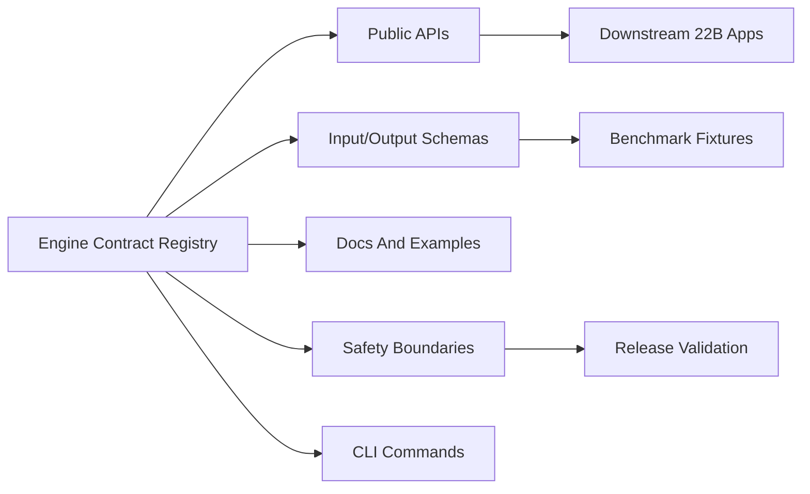

# Engine Contract Registry

[한국어](engine_contracts.ko.md)

Phase 13 freezes the public contract surface for the current reusable engine suite. The goal is not to declare the project finished; it is to stop future depth work from drifting across unclear boundaries.

## Contract Purpose

Each engine contract declares:

- Public API names.
- Input and output schema names.
- CLI commands, if any.
- Example files and documentation files.
- Safety boundaries that must remain true when the engine is reused alone.
- Compatibility notes for pre-1.0 changes.



## Validate Contracts

```powershell
python -m paideia_engines.cli validate-contracts `
  --repo-root . `
  --output .paideia-runs/contract-validation.json
```

The command fails if a required engine is missing from the registry, if contract names are duplicated, or if documented package, example, and README paths are missing.

## Compatibility Policy

- Before `1.0`, additive public API and schema changes are allowed.
- Breaking changes require a new `/vN` schema and migration note.
- Deprecations must be documented before removal.
- Orchestration must not hide engine-specific contracts.

## Current Contracted Engines

- Data acquisition
- Curriculum mapping
- Cultivation
- Assessment
- Stress
- Promotion
- Governance
- Runtime
- Orchestration
- Evaluation

## Trust Boundary Notes

- Orchestration outputs must declare trace schema v2 when promotion is sequenced after governance and runtime.
- Promotion must preserve governance-blocked promotion quarantine as a contract: blocked governance cannot create active memory, only quarantined reviewable records.
- `quarantine_reason` is a force-quarantine signal. A governance-blocked quarantine cannot be promoted during reconsideration without a fresh allowed governance decision carried as a `paideia-governance-review/v1` governance review payload for `memory_promotion`, scoped to the quarantined `experience_id`, the promotion-issued `quarantine_ref`, and `active_memory` use, with an active `boss_approval` record for that same `experience_id` and `quarantine_ref` present in the governance approval ledger.
- Assessment may count a verified artifact for deterministic rubric scoring, but release-grade promotion must treat it as evidence only after runtime evidence validation proves file existence, byte hash, manifest hash, and replay trace.

The registry lives in `src/paideia_engines/contracts/registry.py`.
